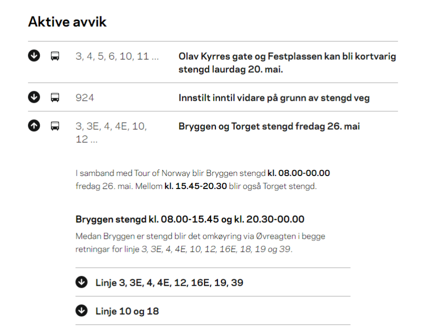

# Deviation Tracker

A REST API that tracks the deviations of the public transport in the Bergen Region.
The API wraps a web scaper for [skyss.no/avvik](https://www.skyss.no/avvik/)

## Tech stack

Written in Kotlin using [SpringBoot](https://spring.io/projects/spring-boot) for API and [Jsoup](https://github.com/jhy/jsoup) for web scarping

## How to build
TODO

## Documentaion
TODO

## Limitations

### Volatile to changes made by Skyss
The service is built on top of a web scraper, this introduces some volatility, the service might stop working correctly if the structure of [skyss.no/avvik](https://www.skyss.no/avvik/) changes.

### Web scraping
In the case that a lot of lines are grouped togheter as one deviation, it might happen that not all the lines are picked up as part of the devaiton due to not all of them being included in the heading. In theses cases Skyss puts the relevant lines in the message text rather then the heading and thus might not be picked up by the scraper.

Example:

The lines: 3, 3E, 4, 4E, 10, 12, 16E, 18, 19 39, are expirincing a deviation in their regualar service, but the scraper is only able to detect deviations in lines: 
3, 3E, 4, 4E, 10, 12,  
missing the lines: 
16E, 18, 19, 39.

This could possbily be addressed in the future by creating a set of known routes, and then searching the message of all deviations of routes.

## License
See: [LICENSE.md](LICENSE.md)
